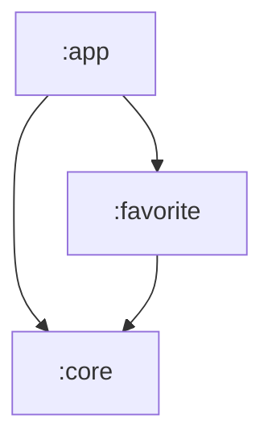

# 📰 The News App: A Masterclass in Modern Android Development

**A Deep Dive into Clean Architecture, Modularization, and Security Best Practices**

> *"The only way to go fast, is to go well." — Robert C. Martin*

---

## 👋 Introduction

Welcome to **The News App**. On the surface, this is a refined application that fetches top stories from the **New York Times** and allows users to curate a personal collection of favorite articles.

But look beneath the surface. This repository is designed as a **living monograph**—a comprehensive educational resource that bridges the gap between "Hello World" tutorials and enterprise-level engineering.

This document is written as a technical deep-dive (approx. 20 min read) to walk you through every architectural decision we made. We have stripped away the basics to focus on the *why* and *how* of building scalable, secure Android applications.

---

## 📖 Table of Contents

1.  [The Architectural Philosophy](#-the-architectural-philosophy-why-clean)
2.  [The Journey of a Data Packet](#-the-journey-of-a-data-packet)
3.  [The Magic of Dependency Injection](#-the-magic-of-dependency-injection)
4.  [Modularization Strategy](#-modularization-the-lego-strategy)
5.  [Security: The Digital Fortress](#-security-building-a-digital-fortress)
6.  [Asynchronous Data Flow](#-asynchronous-data-flow)
7.  [Quality Assurance & Testing](#-quality-assurance--testing)

---

## 🏗 The Architectural Philosophy: Why Clean?

In the early days of Android, developers often fell into the trap of the "God Activity"—placing network calls, database logic, and UI updates into a single file. This approach led to apps that were fragile, untestable, and impossible to maintain.

This project strictly follows **Clean Architecture**. The core principle is **Separation of Concerns**. We divide the application into three concentric circles (layers), where dependencies only point *inwards*.

### 🏁 Layer 1: The Domain (The Inner Circle)
*The Laws of the Business.*

This is the most critical layer. It contains the **Business Logic**—the rules that would remain true even if this app were a command-line tool or a web server. It has **zero dependencies** on the Android Framework.

-   **Location**: `:core/domain`
-   **Key Components**:
    -   **Entities**: Pure Kotlin data classes (e.g., `News`).
    -   **Use Cases**: Single-responsibility actions (e.g., `GetTopStoriesUseCase`).
    -   **Interfaces**: Contracts that the Data layer must fulfill (e.g., `INewsRepository`).

### 🔌 Layer 2: The Data (The Adapters)
*The Implementation Details.*

This layer is the bridge between the Abstract (Domain) and the Concrete (Database/Network). It adapts outside data sources to the Domain's needs.

-   **Location**: `:core/data`
-   **The Repository Pattern**: The "Single Source of Truth." It coordinates data fetching and mapping.
-   **Data Mappers**: Transforms raw JSON (`NewsResponse`) into clean Domain Entities (`News`).

### 📱 Layer 3: The Presentation (The Framework)
*The User Interface.*

This layer is strictly for display. It knows *how* to render a list, but it relies on the Domain layer to tell it *what* to render.

-   **Location**: `:app` and `:favorite`
-   **ViewModel**: Converts Domain data into **UI State**.
-   **UI**: XML Layouts and Fragments that observe the State.

---

## 🔄 The Journey of a Data Packet

To truly understand the architecture, let's trace the lifecycle of a request from the UI to the Network and back. This is the "Story" of how a News Article appears on your screen.

### Step 1: The UI Asks (Presentation Layer)
The user opens the app. The `HomeFragment` subscribes to the `HomeViewModel`.
The ViewModel doesn't know about Retrofit or Room. It simply asks the Domain layer for data.

```kotlin
// HomeViewModel.kt
fun fetchNews(section: Section) {
    viewModelScope.launch {
        // The ViewModel asks the UseCase. It doesn't care HOW the data is fetched.
        newsUseCase.getTopStories(section).collect { resource ->
            _newsState.value = resource
        }
    }
}
```

### Step 2: The Domain Orchestrates (Domain Layer)
The `GetTopStoriesUseCase` receives the request. In this app, the logic is simple: "Get the news." In a complex app, this is where we would check subscription status, filter blocked authors, or re-rank stories.

### Step 3: The Repository Decides (Data Layer)
The `NewsRepository` is the brain of the data layer. It decides where to look. for "Top Stories", it goes to the network.

### Step 4: The Network Calls (Remote Data Source)
We use **Retrofit** to communicate with the NYTimes API. We define an interface that represents the API endpoints.

```kotlin
// ApiService.kt
interface ApiService {
    @GET("{section}.json")
    suspend fun getTopStories(
        @Path("section") section: String,
        @Query("api-key") apiKey: String
    ): NewsResponse
}
```

### Step 5: The Transformation (Mapper)
The API returns a `NewsResponse` (a complex JSON object/DTO). We don't want this leaking into our app. If the API changes its field names, we only want to fix it *here*, not in the UI.
We use a `DataMapper` to convert `NewsResponse` -> `List<News>`.

### Step 6: The Return Trip
The clean `List<News>` flows back up:
`Repository` -> `UseCase` -> `ViewModel` -> `Fragment`.
The Fragment submits the list to the `RecyclerView` adapter, and the user sees the headlines.

---

## 💉 The Magic of Dependency Injection

You might wonder: *How does the ViewModel get the UseCase? How does the Repository get the API Service?*

We use **Hilt** (built on Dagger 2) to handle this wiring automatically.

### Providing the Network
In `NetworkModule.kt`, we tell Hilt how to create an `OkHttpClient`. This is where we configure timeouts and security (Certificate Pinning).

```kotlin
@Module
@InstallIn(SingletonComponent::class)
object NetworkModule {
    @Provides
    @Singleton
    fun provideOkHttpClient(): OkHttpClient {
        return OkHttpClient.Builder()
            .connectTimeout(120, TimeUnit.SECONDS)
            .certificatePinner(certificatePinner) // Secure connection
            .build()
    }
}
```

### Providing the Database
In `DatabaseModule.kt`, we tell Hilt how to create the encrypted database.

```kotlin
@Provides
@Singleton
fun provideDatabase(@ApplicationContext context: Context): NewsDatabase {
    return Room.databaseBuilder(context, NewsDatabase::class.java, "News.db")
        .openHelperFactory(SupportFactory(passphrase)) // Encryption hook
        .build()
}
```

Because of this setup, we can simply ask for dependencies in our classes using `@Inject`:

```kotlin
class NewsRepository @Inject constructor(
    private val apiService: ApiService, // Hilt provides this!
    private val newsDao: NewsDao        // Hilt provides this!
)
```

---

## 🧩 Modularization: The "Lego" Strategy

Monolithic apps (where all code is in one `app` folder) suffer from slow build times and tight coupling. We adopted a multi-module strategy to handle scale.

### The Structure



1.  **`:core` Module**: The foundation.
    -   Contains code shared across the entire app: Domain entities, Repositories, Database definitions (Room), and Network setup (Retrofit).
    -   **Benefit**: If we wanted to build a WearOS version of this app, we could reuse `:core` entirely without changing a line of database logic!

2.  **`:app` Module**: The main container.
    -   Connects the features together.
    -   Contains the dependency injection (Hilt) setup (`@HiltAndroidApp`).
    -   Hosts the main `NavHostFragment`.

3.  **`:favorite` Module (Dynamic Feature)**:
    -   **Concept**: The "Favorites" screen is isolated in its own module.
    -   **Delivery Type**: **Install-Time**. Even though it is a separate module, we have configured it to be installed *alongside* the main app.
    -   **Why separate it?**
        1.  **Separation**: It forces strict boundaries. The `favorite` feature cannot accidentally access private logic in `app` (or vice-versa).
        2.  **Future-Proofing**: We can easily switch to **On-Demand** delivery (downloading the feature only when the user clicks the tab) in the future.

---

## 🔒 Security: Building a Digital Fortress

In 2024, shipping an app with plain-text user data or unpinned connections is negligence. We treat security as a first-class citizen.

### 1. Database Encryption (SQLCipher)
Standard Room databases are just SQLite files. If a phone is rooted, anyone can copy the `News.db` file and read your personal favorites.

**Our Solution**:
We use **SQLCipher**, an open-source extension to SQLite that provides transparent 256-bit AES encryption.
-   We generate a passphrase (in a real app, this would come from the Android Keystore).
-   We use `SupportFactory(passphrase)` when building the Room database.
-   **Result**: The file on disk is encrypted. Even if stolen, it is useless noise without the key.

### 2. Network Security (Certificate Pinning)
A common technical attack is "Man-in-the-Middle" (MITM), where a hacker on public WiFi forces your phone to trust their fake server.

**Our Solution**:
We implement **Certificate Pinning** in `NetworkModule.kt`. We tell our HTTP client to *only* talk to the server if it presents a specific digital ID card (SHA-256 hash).

```kotlin
val certificatePinner = CertificatePinner.Builder()
    .add("api.nytimes.com", "sha256/QyoTmk8SJYC2gckHjk1XKoMLQch1Rdno6MqEgptz2aU=")
    .build()
```

If the server's ID doesn't match, the app cuts the connection immediately.

### 3. Code Obfuscation (R8)
Reverse engineers can decompile your generic APK to read your code. They can find your API keys, understand your logic, and clone your app.

**Our Solution**:
We enable **R8** (ProGuard) in `release` builds.
-   **Renaming**: `NewsRepository` becomes `a`. `getTopStories()` becomes `b()`.
-   **Shrinking**: It removes unused code, making the app smaller.
-   **Optimization**: It inlines functions to make the app faster.

---

## 🌊 Asynchronous Data Flow

Modern apps must be smooth. We use **Coroutines** and **Flow** to handle background tasks without freezing the UI.

-   **Coroutines**: Lightweight threads. We use them for "one-shot" operations like making a network request (`suspend` functions).
-   **Flow**: A stream of data. The Database emits a `Flow<List<News>>`, meaning any time the database changes (e.g., you add a favorite), the UI updates *automatically* in real-time.

```kotlin
// NewsRepository.kt
override fun getTopStories(section: Section): Flow<Resource<List<News>>> = flow {
    emit(Resource.Loading())
    try {
        val response = apiService.getTopStories(section.apiValue, apiKey)
        val domainNews = DataMapper.mapResponseToDomain(response.results)
        emit(Resource.Success(domainNews))
    } catch (e: Exception) {
        emit(Resource.Error(e.message ?: "Unknown Error"))
    }
}.flowOn(Dispatchers.IO) // Run on background thread
```

This reactive approach ensures the UI is always in sync with the data.

---

## 🛡 Quality Assurance & Testing

We don't trust manual testing alone. We use **GitHub Actions** to automate our quality gates. Every Pull Request runs through the `Android CI` workflow:

### 1. Static Analysis (Lint)
The first line of defense. Lint checks for stylistic errors, potential bugs, and accessibility issues.
-   *Why?* Helps maintain a consistent codebase without human intervention.

### 2. Unit Testing
We test our business logic using **JUnit** and **Mockito**.
-   **What do we test?** UseCases, ViewModels, and Repositories.
-   **What do we mock?** The API and Database. We pretend they return success or error states to verify how our logic handles it.

### 3. Leak Detection (LeakCanary)
Memory leaks are silent killers. They crash apps after extended use.
-   **Our Solution**: **LeakCanary** runs in debug builds. It automatically detects if an Activity or Fragment is kept in memory after it should have been destroyed.

---

*This project is intentionally designed as a learning resource. By exploring the code, you are exploring the industry standards for modern Android development.*
